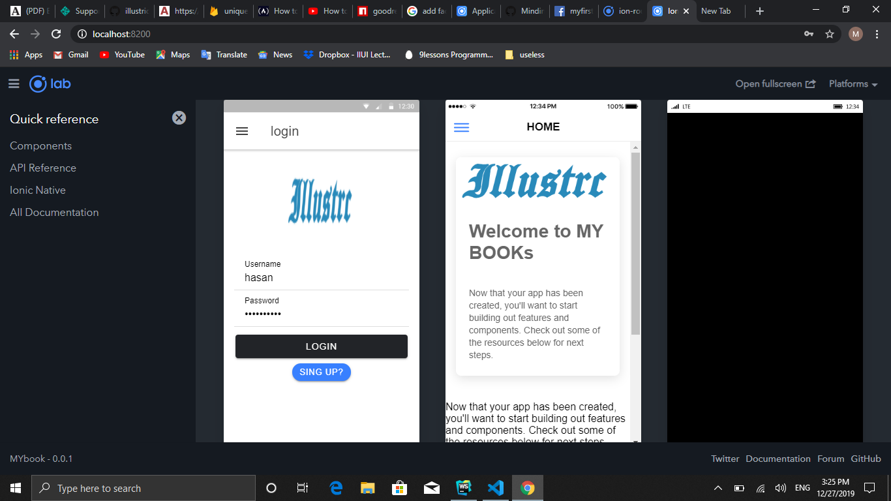
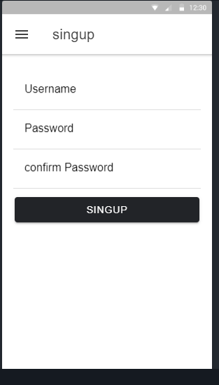
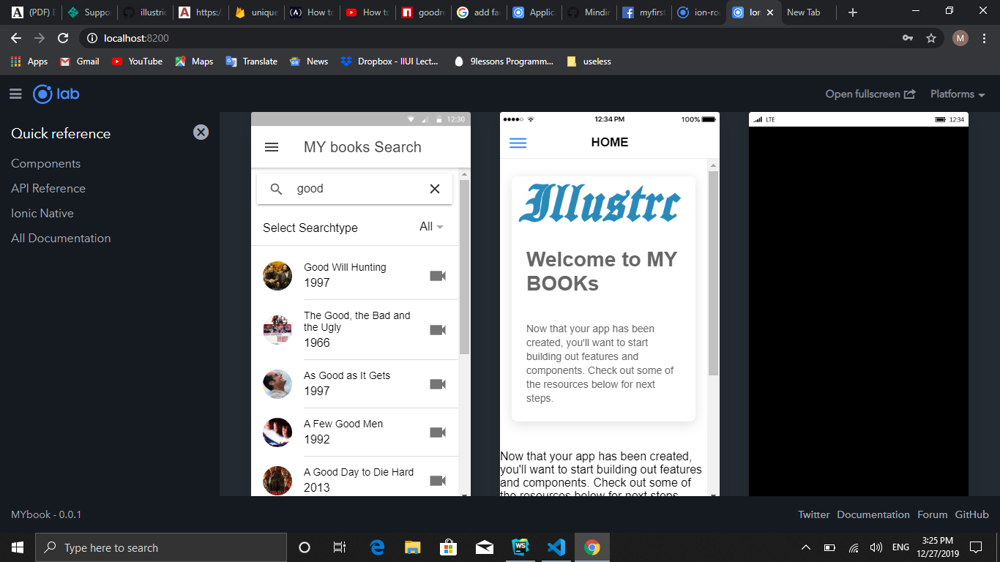
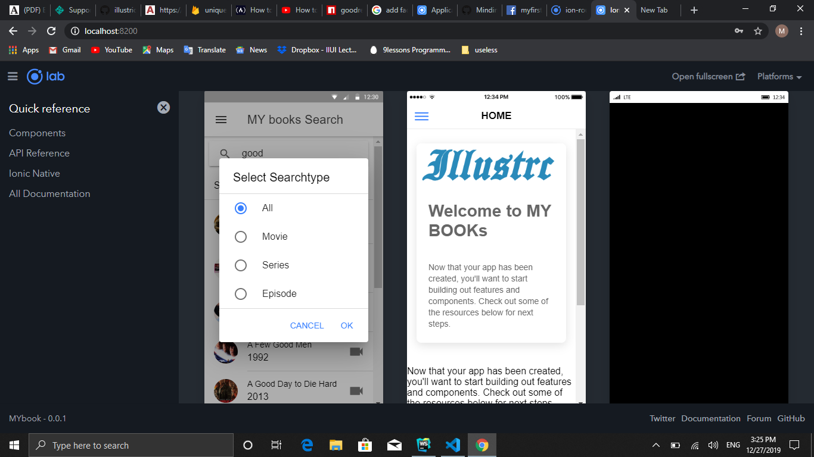
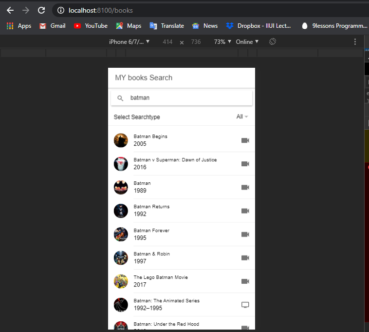

<h1>ILLUSTRIC</h1>

This is project of of illustric group to keep record of books (movies), 
user can make profile , and see movies and their details. logo of illustric is 

 

<h1>Pages</h1>

teacher requriment is 6 pages  
the pages that i have created 

<ul>
  <li>Home</li>

  <li>Login</li>

  <li>sing up</li>

  <li>book</li>

  <li>book details</li>

  <li>read</li>

  <li>Face book  login</li>

  <li>Profile page</li>

  <li>about us</li>
 
  <li>contact us</li>
</ul>
<>
<h1>Techanlogy</h1>
-> Angular  
-> Ionic Framework  

 
<h1>Database</h1>
-> firebase  
-> Deployed on mlab.com
 
 

the login singup during demo

 
 

search during demo

 

sort during demo 

 

movie geting and details of batman demo

<h1>About us</h1>

in about us page provide detail about developer. provide links of email and git link 
icon  used instead of picture

contact on git  <a href="https://github.com/illustric">git</a>
contact on facebook  

<h1>Running Project</h1>
-> git clone or download repository 
-> npm install 
<h2>Thanks!</h2>
<h3>Regards:</h3>
<>

Muhammad adeel
